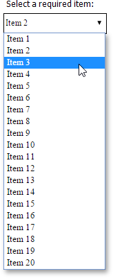

# Reporting for Web Forms - How to use custom controls for editing report content in Print Preview

This example demonstrates how to create and register custom editors to be used for [editing the content of report controls in Print Preview](https://docs.devexpress.com/XtraReports/117343/detailed-guide-to-devexpress-reporting/provide-interactivity/edit-content-in-print-preview). In particular, it shows how to create a combo box editor, a date editor with a custom format, and a standard text editor with a phone number mask.

The following image illustrates a custom combo box editor:

 

## Files to Review

* [Default.aspx](./CS/T460713/Default.aspx) (VB: [Default.aspx](./VB/T460713/Default.aspx))
* [Default.aspx.cs](./CS/T460713/Default.aspx.cs) (VB: [Default.aspx.vb](./VB/T460713/Default.aspx.vb))

## Documentation

* [Use Custom Controls](https://docs.devexpress.com/XtraReports/2607/detailed-guide-to-devexpress-reporting/use-report-controls/use-custom-controls)

## More Examples

- [Reporting for WinForms - Create a Custom Progress Bar Control](https://github.com/DevExpress-Examples/reporting-winforms-custom-progress-bar-control)
- [Reporting for WinForms - How to use custom controls for editing report content in Print Preview](https://github.com/DevExpress-Examples/reporting-winforms-custom-controls-for-editing-report-content-in-print-preview)
